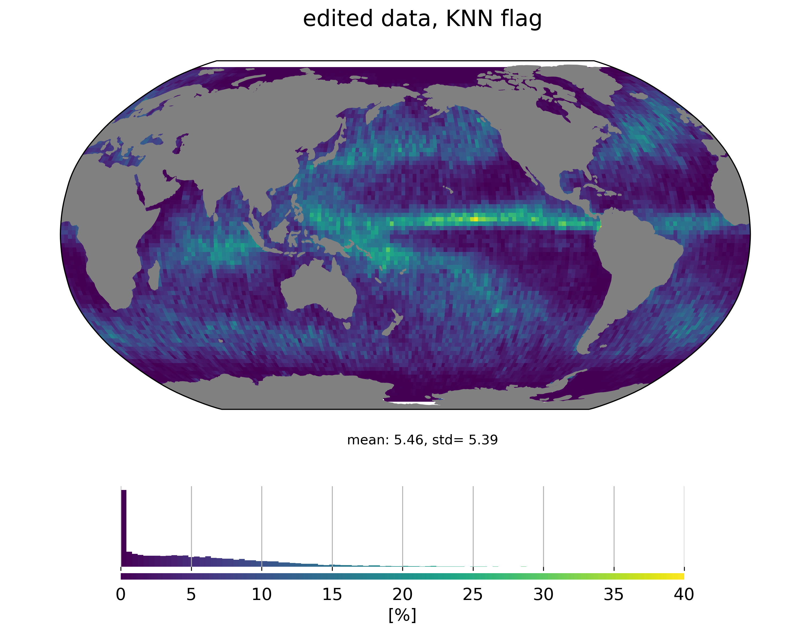
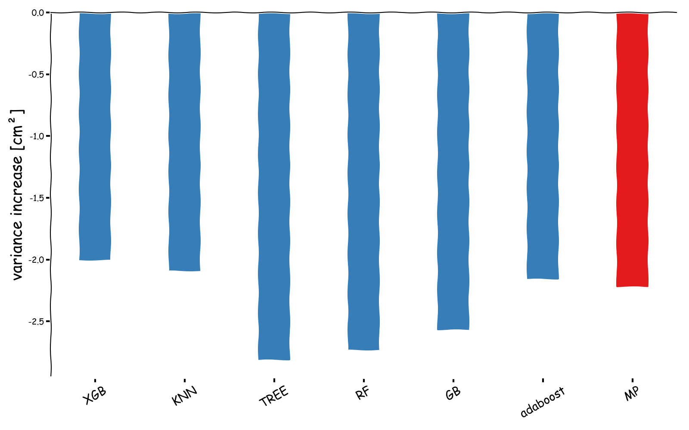
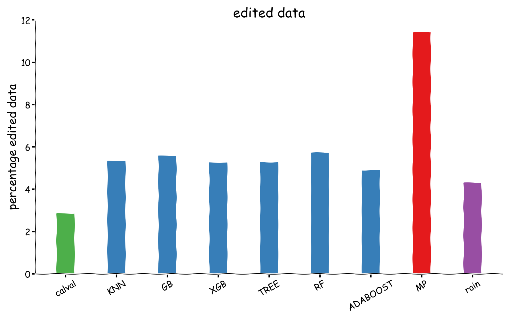

# Detecting rain in satellite radar altimetry measurements

## context & motivation

For those unfamiliar with satellite radar altimetry, let's just say that we send an instrument (called an altimeter) in space. This instrument sends a radar wave towards the Earth surface and waits for its reflection to come back. A precise clock on board measures this two way travel time which can be converted to a distance.

In practice satellite radar altimetry is a bit more complex, but this simple description is enough to understand the context and motivation for this study.

For a more accurate description, one can refer to this [one-pager](https://www.eumetsat.int/altimetry-technique) by EUMETSAT, or to this more complete [tutorial](http://www.altimetry.info/radar-altimetry-tutorial/).

When the radar wave travels through the atmosphere, it can be impacted (delayed and attenuated mainly) by rain (among other effects).

On the other hand machine learning (ML) and artificial intelligence (AI) algorithms have recently become extremely efficient at detecting events from a set of predefined features, or even at learning what the right features are to solve the classification problem at hand.

So the question that arises is **can we use ML/AI algorithms to detect measurements impacted by rain cells in satellite radar altimetry data ?**
And if it works, this may have wider implications on the way we flag (reject measurements considered as bad) altimetry data and how we could automate learning the 'sweet spot' of data editing. 

### why SARAL/AltiKa is the perfect candidate

SARAL/AltiKa was launched in 2013. Its a cooperative mission between [CNES](https://cnes.fr) and [ISRO](https://www.isro.gov.in/). It is also the first radar altimetry mission to embark a Ka-band radar (rather than Ku-band). 

The Ka-band is more [sensitive to rain](http://www.satmagazine.com/story.php?number=2058631290) and is therefore a perfect candidate: larger impacts should be easier to detect.
Originally this was even a foreseen issue on SARAL: due to the senstivity of the Ka-band, how large would be the fraction of measurements lost (or too attenuated) ? 
Thanks to large margins on the altimeter link budget at design stage, this was in practice not an issue and SARAL/AltiKa's data availability rates are above mission requirements today.

## experiment

### rain rates over the ocean

Rain rates are extracted from SSMIS aboard DSMP F-16, F-17 and WindSat radiometer data records. We colocated those data to SARAL/AltiKa measurements within 5 minutes. 
The colocation pattern is driven by orbital constraints and results in a typical geographical pattern shown below:

<figure>
     
    <figcaption>*fraction of colocated SARAL/AltiKa measurements with a time difference below 5 minutes*</figcaption>
</figure>

Averaging rain rates over a long period provides an overview of the rain distribution over the oceanic domain:

<figure>
     
    <figcaption>*Average rainfall rate over ocean from colocations to SARAL/AltiKa measurements*</figcaption>
</figure>
Rain is mainly present in the [ITCZ](https://en.wikipedia.org/wiki/Intertropical_Convergence_Zone) region and midlatitudes of norhern and southern hemispheres. Rather than predict rainfall rate, we try to predict the presence of rain (in an attempt to smplify the problem).
We therefore estimate a boolean rain flag (rain/non rain) which set to True (rain) is the colocated rainfall rate is positive.
The resulting map of the ratio of 'rainy' SARAL/AltiKa measurements is shown below:

<figure>
     
    <figcaption>Fraction of SARAL/AltiKa measurements detected as 'rainy' based on colocations</figcaption>
</figure>
This database is used as a training set for all subsequent supervised learning experiments.
Note that we did not test the sensitivity of our results to different methods to construct the training set (*e.g.* setting the rain flag above another rainfall rate threshold).

### current algorithm for SARAL rain flagging

There is already a rain-detecting algorithm implemented in SARAL/AltiKa processing chains.
This algorithm relies on the high frequency variablity of the trailing edge of the waveform.
This method has been initially designed by [Tournadre (1999)](https://www.academia.edu/28146154/Estimation_of_rainfall_from_Ka_band_altimeter_data_computation_of_waveforms_in_presence_of_rain)
and tuned post-launch to real-world data by [Tournadre et al. (2015)](https://archimer.ifremer.fr/doc/00286/39674/41519.pdf).

One issue with this algorithm is that it may misinterpret other events (such as mispointing events) as rain events. And SARAL/AltiKa mispointing events are not rare... 

<figure>
    
    <figcaption>*percentage of flagged data, according to the product flag*</figcaption>
</figure>

For example the yellow line around Antarctica in the map above is linked to zero-crossings of reaction wheel speed on SARAL which led to small mispointing events.

The product flag is used as a reference when benchmarking our ML/AI classifiers.

## simple ML algorithms are good for 1Hz data

We tested a variety of methods from the ML toolbox, combined with different choices for features to be used as predictors.
Implementations were taken [scikit-learn](https://scikit-learn.org/stable/).

Among the features used of of course the retracking outputs (backscatter, waves) and the variability within the 40 high rate measurements used to construct the 1Hz measurement (stddev of range, swh and backscatter).
Some experiments included brightness temperatures from the MWR onboard SARAL. 

Results from these experiments show that we are able to train rain classifiers that are more specific than the matching puirsuit flag that is available in the product. 
Even with simple algorithms such as [KNN](https://ieeexplore.ieee.org/abstract/document/549118).
Inlcuding MWR brightness temperatures as features helps of course, but even without this info, the classifiers exhibit good precision levels (> 0.8).

Looking at the geographical distribution of measurements classified as rain events shows that it is much more consistent with rain distribution:

<figure>
    
    <figcaption>percentage of edited data, based on a KNN classifier</figcaption>
</figure>

We've also performed an assessment of what performance improvement one could get by removing measurements impacted by rain by computing the variance of SSH differences at crossovers:

<figure>
    
    <figcaption>Variance of SSH differences increase (negative values mean the variance has decreased) when removing rain events as predicted by different algorithms. </figcaption>
</figure>
 
The figure includes the standard Cal/Val flagging process (in green), the colocated rain flag (in purple) and the matching pursuit flag (in red). 
ML classifiers or on par or better than the matching puisuit flag. 
Variance reduction at crossovers needs to be balanced with the number of edited data:

<figure>
    
    <figcaption>percentage of edited data for different classifiers</figcaption>
</figure>

It's clear that the improvement brought by the matching pursuit comes at the cost of removing more than 10% of the data (in red). In contrast all our ML classifiers (in blue) remove around 6% of the data.
As a reference the standard Cal/Val flag is provided in green.

So even simple ML algorithms are able to provide more specific rain detectors that provide comparable mission performance gains while removing less data than the matching pursuit flag currently available in SARAL/AltiKa GDR-F products.

## things get a bit more complicated at 40Hz